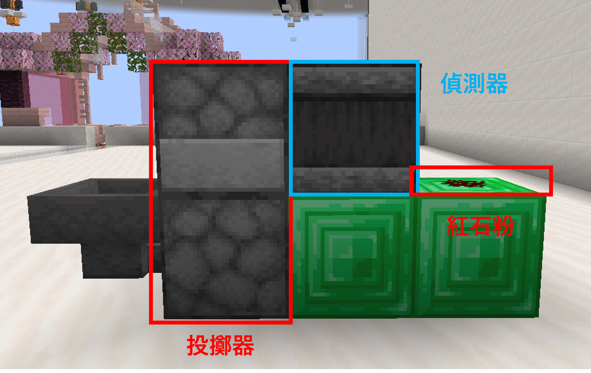

# 廢土對賭機器人

✨一個由 jimmy20180130 製作的完全開源且免費的廢土對賭機器人✨

---

## 🌟 功能特點

### 1. 跨平台整合與綁定

- **遊戲綁定**：在遊戲內輸入 `/m <機器人ID> link` 取得驗證碼後，前往 Discord 伺服器使用 `/link <驗證碼>` 指令進行綁定。
- **同步運作**：Minecraft 機器人與 Discord 機器人同時運行，支援在特定 Discord 頻道中顯示下注紀錄、後台等。

### 2. Minecraft 遊戲內控制與功能

> 💡 **提示：** 以下指令皆需以 `/m <機器人ID>` 作為開頭。

- **一般使用者指令：**
  - `daily` - 領取每日獎勵（具備身份組獎勵加成）。
  - `deposit` - 將遊戲幣存入機器人。
  - `link` - 綁定 Discord 帳號。
- **自動接受傳送**：若為具有權限的管理員發送 `/tpa` 或 `/tpahere`，機器人將自動接受；其餘玩家則拒絕。
- **管理員指令：**
  - `epay/cpay <玩家 ID> <金額>` - 讓機器人轉帳指定金額給指定玩家。
  - `money` - 查看機器人目前有的遊戲幣。
  - `reload` - 重啟機器人。
  - `stop` - 停止機器人。

### 3. 對賭系統

- **機器建造：**
  請參考以下圖片放置
  
  

- **前置作業：**
  1. 準備兩組羊毛（如一組黑、一組白），供投擲器作亂數結果並使用 `/sign` 與 `/nopickup` 設定。
  2. 放入中間上半部投擲器後，右鍵點擊紅石粉測試是否正常丟出羊毛。
- **操作方式：**
  - 將機器人放置於**可觸及紅石粉且不會吸取羊毛**的位置。
  - 玩家使用 `/pay <機器人ID> <下注金額>` 後，機器人偵測到付款會自動觸發紅石粉進行開獎。
  - 遊戲中的對賭為全自動化並支援排隊機制，多人下注也會依序列隊處理。
  - 可於設定檔自訂黑白羊毛的賠率。

---

## 🚀 開發與自行架設指南

### 系統與環境需求

- **執行環境**：[Bun](https://bun.sh/) (非 Node.js)
- **基礎需求**：一個 Minecraft 帳號（需具有在廢土使用顏色代碼權限）、一個 Discord 機器人 Token，以及遊戲內建置好的對賭裝置。

### 1. 一般玩家本地架設

前往 GitHub 的 **Release** 頁面 下載最新版本壓縮檔。建立新資料夾後解壓縮，依指示填妥設定檔即可執行。

### 2. 開發者與手動編譯

1. **依賴環境安裝**：系統需安裝 Bun 以執行專案。
2. **準備設定檔**：將參數寫入 `config.toml`；若需本地環境覆蓋設定或保留登入金鑰 (Secrets)，可建立 `config.local.toml`。
3. **啟動測試**：

   ```bash
   bun run index.js
   ```

4. **輸出執行檔 (Windows)**：使用內建腳本編譯可執行檔。結果將生成至 `dist/mcf-bet-bot.exe`。

   ```bash
   bun run scripts/build.js
   ```

---

## 📂 專案架構概覽

- `index.js`：程式進入點與啟動協調。
- `core/`：機器人執行階段，分別有 `mcBot.js` (Minecraft 核心) 與 `dcBot.js` (Discord 核心/Slash Commands 註冊)。
- `commands/`：針對不同平台的指令模組。包含 `discord/` 與 `minecraft/` 等指令清單清單。
- `services/`：業務邏輯與流程服務 (如：`betService.js` 中的對賭行為、`configService.js` 設定檔讀寫)。
- `models/`：SQLite 資料模型，負責保存帳號或簽到等紀錄。
- `database/index.js`：資料庫連線與自動 Bootstrap 初始化。
- `locales/`：i18n 多語系與使用者面向文案設定檔 (`zh_TW.json`)。

---

## ⚠️ 免責聲明

- **風險提示**：使用者應自行承擔機器人使用的風險，包括但不限於因遊戲或機器人更新導致的遊戲內破產或帳號遭伺服器封禁。
- **合規要求**：使用此程式時，請確保您的行為符合 Minecraft 及廢土伺服器的相關使用條款。機器人的使用者、架設者及管理員應對其使用行為負全部責任，並遵守相關法律法規。
- **免責條款**：在任何情況下，作者及相關方均不對因使用本機器人而導致的任何直接、間接或意外損失承擔責任。
- **條款變更**：作者保留隨時更新或修改免責聲明的權利，請定期查看以了解變更。
- **技術支援**：如遇問題，可至我們的 Discord 伺服器詢問。我們提供有限的技術支援，但不保證解答所有問題。

---

## 參考來源

- [Mineflayer Examples](https://github.com/PrismarineJS/mineflayer/blob/master/examples)
- [Discord.js](https://discord.js.org/docs/packages/discord.js/main)
